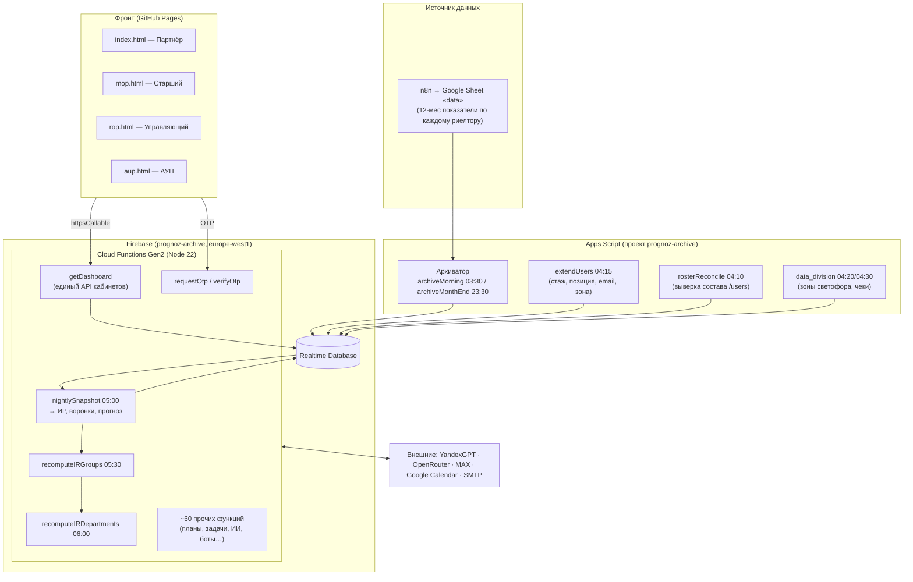
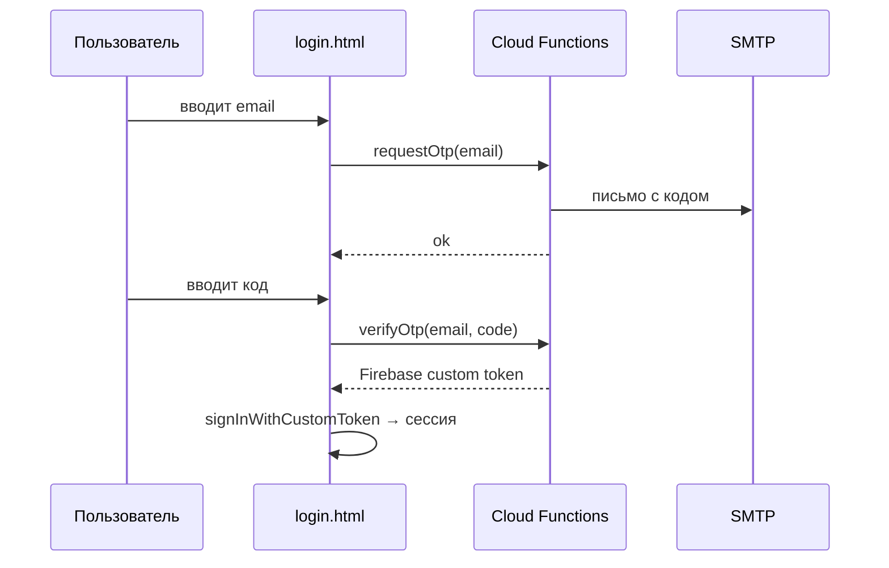

# Прогноз — архитектура системы (для переноса во внутреннюю систему)

> Документ для разработчиков. Описывает, как устроена и как работает система
> «Прогноз» (и родственный «Премиум») — фронт, бэкенд, модель данных, пайплайн
> данных, бизнес-логику и внешние интеграции. Цель — дать полную картину для
> переноса во внутреннюю систему «Этажей».
>
> Рабочий язык проекта — русский. Автор/заказчик — Егор Бондарчук.

---

## 1. Что это и зачем

**«Прогноз»** — система управления продажами для агентства недвижимости «Этажи».
Веб-дашборд показывает риелторам (партнёрам) и их руководителям:

- **Индекс Развития (ИР)** — интегральный показатель качества работы (4 составляющие);
- **воронки** покупателя и продавца (поток → горячие → задатки → сделки);
- **прогноз** дохода/валовой выручки на текущий и следующий месяц;
- **позицию в «светофоре»** (рейтинг риелторов по зонам);
- **персональные рекомендации** (движок «тренер» + ИИ-тренер);
- **задачи** и календарь.

Есть два фронта на общем бэкенде:

| Проект | Домен | Репозиторий | Статус |
|---|---|---|---|
| **Прогноз** (v1) | https://prognoz.info | `prognoz-dashboard` (этот) | боевой |
| **Премиум** (v2) | https://premium.prognoz.info | `prognoz-premium` | боевой с 07.07.2026 |

**Бэкенд общий** — те же Cloud Functions в проекте `prognoz-archive`, та же
Realtime Database. Любая правка в `prognoz-functions/functions/` влияет на оба
фронта сразу.

---

## 2. Технологический стек

| Слой | Технология |
|---|---|
| **Фронтенд** | Статические HTML + **ванильный JS** (ES-модули), **без сборки и фреймворков**. Графики — самописный SVG (не Chart.js). |
| **Хостинг фронта** | GitHub Pages (`prognoz.info` через CNAME) |
| **Бэкенд** | Firebase **Cloud Functions Gen2**, Node.js 22 |
| **База данных** | Firebase **Realtime Database** (RTDB), не Firestore |
| **Аутентификация** | Firebase Auth + собственный **Email OTP** (одноразовые коды) |
| **Регион** | `europe-west1` |
| **Firebase-проект** | `prognoz-archive` |
| **Источник данных** | Google Sheets (лист `data`, наполняется из **n8n**) → Apps Script-архиватор → RTDB |
| **LLM** | YandexGPT (основной) + OpenRouter (deepseek) — ИИ-тренер и ассистент |
| **Мессенджер** | MAX-бот (webhook), почта — SMTP (nodemailer) |
| **Календарь** | Google Calendar OAuth |
| **CI/CD** | GitHub Actions (деплой функций в обход корпоративной сети) |

Зависимости бэка (`package.json`): `firebase-admin`, `firebase-functions`,
`nodemailer`, `undici`. **Больше ничего** — вся бизнес-логика самописная.

CDN self-hosted: Firebase SDK 10.7.0 и библиотеки лежат в `libs/` + import map
(перенаправление `gstatic` → `/libs/`), потому что корпоративная сеть «Этажей»
режет gstatic/Cloudflare.

---

## 3. Общая схема



**Суточный цикл (МСК):** ночью данные втекают из n8n → архиватор кладёт снимок в
`/archive` → в 05:00 `nightlySnapshot` считает ИР/воронки/прогноз в `/snapshots`
и `/forecast` → агрегаты по группам/отделам. Днём кабинеты читают готовое через
единый `getDashboard`.

---

## 4. Фронтенд

### 4.1. Кабинеты (4 роли)

Все партнёры лично продают, поэтому у каждой роли есть **личный** план/воронка
плюс (у руководителей) командный контекст.

| Файл | Роль (UI) | `view` в getDashboard | Что показывает |
|---|---|---|---|
| `login.html` | Вход (Email OTP) | — | Авторизация |
| `index.html` | **Партнёр** (realtor) | `partner` | Личный кабинет риелтора |
| `mop.html` | **Старший партнёр** (mop) | `group` | Группа + свой личный |
| `rop.html` | **Управляющий партнёр** (rop) | `department` | Отдел (группы) + свой |
| `aup.html` | **АУП** (aup) | `company` | Компания (отделы) |

**Единый стиль:** холодная сине-серая палитра, верхние табы-пилюли, адаптив до
1080px. **Drill-down:** `aup.html` → `rop.html?rop=` → `mop.html?mop=` →
`index.html?agent=`. Просмотр чужого кабинета — через query-параметры
`?agent=/?mop=/?rop=` (доступ проверяет `auth-guard.js`).

### 4.2. Общие JS-модули фронта

| Файл | Назначение |
|---|---|
| `auth-guard.js` | Защита страниц, роли, `canRead`, авто-роутинг по рангу (`RANK={index:1,mop:2,rop:3,aup:4}`) |
| `assistant.js` | Ассистент «Прогноша» (виджет-чат во всех кабинетах) |
| `calendar.js` | Календарь + задачи (в т.ч. чтение Google Calendar) |
| `nav.js` | Навигация/шапка |
| `connect.js` | Инициализация Firebase, вызовы функций |
| `metrika.js` / `metrics.js` | Аналитика |
| `firebase-reader.js`, `ir.js` | Утилиты чтения/расчётов |

**Стиль кода фронта:** ванильный JS, ES-модули, без сборки. Скрипты подключаются
как `type="module"`, поэтому инлайн-обработчики вешаются на `window.*`.

### 4.3. Авторизация и роутинг

Firebase хранит сессию локально → большинство входов идут **не** через OTP.
При заходе на `prognoz.info` пользователь попадает на `index.html`; если роль
`mop/rop/aup/admin` и нет явного `?agent=`, `requireAuth` в `auth-guard.js`
автоматически перекидывает на соответствующий кабинет (`mop.html` и т.д.).
Кабинет выше своей роли → редирект домой (защита от «белого экрана»).

---

## 5. Бэкенд — Cloud Functions

Расположение: `/Users/egor/prognoz-functions/functions/`. Точка входа —
`index.js` (реэкспортирует ~70 функций). **Чистая бизнес-логика вынесена в
`lib/`** — она не зависит от Firebase, гоняется локально и покрыта тестами
(`test/`, `verify-patch.js` — 24 эталонных числа должны оставаться зелёными).

Все функции — Gen2, регион `europe-west1`. Типы: `onCall` (вызов из браузера),
`onSchedule` (крон), `onRequest` (webhook).

### 5.1. Каталог функций по категориям

**Auth (не трогать):**
- `requestOtp`, `verifyOtp`, `cleanupExpiredOtps` — Email OTP.

**Кабинет (главный API):**
- `getDashboard` — **единый эндпоинт**, отдаёт всё для кабинета. Параметр `view`
  = `partner`/`group`/`department`/`company`.
- `getSessionReport`, `searchUsers`.

**Планы и цели:**
- `calculatePlan`, `recomputePlansAdmin` — расчёт норм воронки (версия `a8v6`).
- `setGoal` — смена цели/ЗП партнёра; **сразу** пересчитывает план и ИР.
- `assignAutoGoals` / `assignAutoGoalsAdmin` — ночная автоцель.

**Ночной цикл / ИР / прогноз:**
- `nightlySnapshot` / `nightlySnapshotAdmin` — снимок ИР, воронок, прогноза.
- `refreshUserSnapshotAdmin` — пересчёт одного партнёра.

**Агрегаты (группы/отделы):**
- `recomputeIRGroups`, `recomputeIRDepartments`, `recomputeAggregatesAdmin`.

**Диагностика/тренер:**
- `runCoach` / `runCoachAdmin`, `auditCoachCodes`.
- `deptManagerFeedbackAdmin` — ИИ-разбор менеджеров/РОПа (YandexGPT).

**Задачи и уведомления:**
- `createTask`, `updateTaskStatus`, `updateTaskProgress`, `expireTasks`,
  `markNotificationsRead`, `backfillTaskAuthors`.

**Сценарии/эскалация (кроны):**
- `runScenariosDaily(+Admin)`, `cleanupScenarioTasksAdmin`.
- `escalateNRiskDaily(+Admin)`, `backfillRiskHistoryAdmin` — эскалация «в риске» Н1-Н4.
- `genCoachTasksWeekly(+Admin)` — авто-генерация задач тренера.

**ИИ-тренер (LLM):**
- `generateAiCoachBatch` — 1 вызов LLM → 3 текста (партнёру / мотиватор / бриф
  руководителю). Только ручной запуск. `aiCoachStatus` — диагностика.

**Внешние интеграции:**
- `maxWebhook`, `maxSendBrief`, `maxSendMany/ManagerBriefsAdmin`,
  `maxRegisterWebhookAdmin`, `maxTestSend` — MAX-бот.
- `askPrognosha`, `debugAskPrognoshaAdmin`, `prognoshaStatsAdmin` — ассистент.
- `googleCalendarAuthStart`, `googleCalendarOAuthCallback`,
  `createCalendarEventAdmin`, `listGoogleCalendarEvents` — Google Calendar.
- `mopDailySummary`, `ropDailySummary` (+Admin) — ежедневные отчёты руководителям.

**Разовые/админские (обслуживание данных):**
- `zeroizeArchiveCurAdmin`, `restoreArchivePartialAdmin`, `deleteArchiveDateAdmin`,
  `backfillIrV2Admin`, `backfillHistoryAdmin`, `recomputeSvetoforZonesAdmin`,
  `reconcileGrossAdmin`, `restorePlanCyclesAdmin`, `recomputeGroupZeroAdmin`,
  `seedKolmogorovGroupAdmin` и т.д.

**Правило admin-функций:** `cors:true`, доступ только admin/aup, вызов из консоли
браузера на prognoz.info. Нельзя читать большие ветки RTDB целиком (OOM/503) —
прогресс лёгкими маркерами.

### 5.2. `lib/` — чистая логика (ядро для переноса)

Это **самое ценное для переноса** — вся бизнес-математика без привязки к Firebase:

| Модуль | Что считает |
|---|---|
| `ir.js`, `ir_v2.js` | Индекс Развития (старая 8-этапная и новая 4-составная модель) |
| `plan.js`, `calculatePlan` | Нормативы воронки (план по этапам) |
| `funnels.js` | Сборка воронок покупателя/продавца из архива |
| `forecast.js` | Прогноз дохода/вала на текущий/следующий месяц |
| `stretch.js` | Стретч-план (подтяжка конверсии к эталону) |
| `zones.js` | Зоны светофора |
| `aggregate.js` | Агрегация по группам/отделам/компании |
| `coach.js` | Движок «тренер» (диагностика по зоне) |
| `funnelRadar.js` | Паучья диаграмма воронки (12 мес vs норма) |
| `riskStreak.js` | Стрик недель «в риске» (Н1-Н4) |
| `activity.js`, `dates.js`, `labels.js`, `hierarchy.js` | Утилиты |
| `archive.js` | Чтение снимков `/archive` |
| `autocele.js` | Автоцель |
| `yandexgpt.js`, `openrouter.js`, `prognoshaKb.js` | LLM-провайдеры + база знаний ассистента |
| `mailer.js` | Отправка почты/OTP |

---

## 6. Модель данных (Realtime Database)

Основные ветки RTDB (`prognoz-archive-default-rtdb`, `europe-west1`):

| Путь | Содержимое |
|---|---|
| `/users/{код}` | Профиль: name, email, role, mopCode/ropCode, subordinates, позиция, зона светофора, `svetofor_pool` (newbie/experienced), стаж, `status` (active/left), `is_active` |
| `/archive/{YYYY-MM}/{дата}/agents/{код}/` | **Ночной снимок из n8n** (сырьё): `b/`,`s/` (12-мес результаты), `bL/`,`sL/` (опережающие: закрытые/прогноз/остаток), `comm/`,`commAvg/`,`commFact/` (чеки и реальные комиссии), `income`, `flowCur` (поток за месяц) |
| `/plans/{код}/{plan_id}` | План: months[1..6] (нормы+доход), target_zone_id, версия формулы, stretch{} |
| `/goals/{код}/active` | Активная цель: target_revenue_month, is_auto |
| `/forecast/{код}/current` | Прогноз: current_month / next_month / two_mo + сегменты |
| `/snapshots/{код}/{дата}` | Результат ночного расчёта: ИР (`ir_v2_week`, `ir_v2_month`), мини-воронки, позиция, пул. Месячные точки `{YYYY-MM-01}` = история светофора |
| `/aggregates/{group\|department}/{код}/{дата}` | Агрегаты: ИР, breakdown, forecast, счётчики выполняющих/в риске |
| `/coach/{код}/current` | Диагностика тренера (buyer/seller) |
| `/ai_coach/{код}/current` | ИИ-тексты (coach_text, motivator_text, coach_brief_for_manager) |
| `/tasks/{id}` | Задачи (assignee_code, title, due_date, status, author_label) |
| `/notifications/{код}/items` | Уведомления |
| `/data_division/cities/tyumen/` | 24 зоны светофора (range + конверсии + доход), средние чеки, эталонные конверсии |
| `/vocabularies/voc_*/variants/{код}` | Тексты рекомендаций по coach-коду |
| `/system/totals/tyumen` | Размеры пулов светофора |
| `/roster_events/{ym}/runs/{date}` | Журнал движения состава (joined/left/reactivated) |
| `/clients/{partner}/{client_id}` | Клиенты (демо-данные, воронка + ИИ-выжимка + касания) |

**Ключевой принцип:** `/archive` — «сырьё» (что пришло из n8n), `/snapshots` +
`/aggregates` + `/forecast` — «посчитанное» (что показывает кабинет). Кабинет
почти никогда не считает на лету — читает готовое через `getDashboard`.

---

## 7. Пайплайн данных (суточный цикл)

Источник правды по «кто и как работает» — **последняя ночная выгрузка n8n** в
Google Sheet. Расписание (МСК):

```
23:30  archiveMonthEnd        Apps Script  лист data → /archive, ТОЛЬКО последний день месяца
03:30  archiveMorning         Apps Script  лист data → /archive, кроме 1-го числа
04:10  rosterReconcile_write  Apps Script  выверка состава /users + /roster_events
04:15  extendUsers_write      Apps Script  стаж, позиция, зона, лига, email
04:20  importAvgCommissions   Apps Script  городские чеки → /data_division
04:30  importDataDivision     Apps Script  24 зоны/грейда (ТОЛЬКО 1-го числа)
05:00  nightlySnapshot        Cloud Func   снапшоты ИР/воронок + прогнозы
05:30  recomputeIRGroups      Cloud Func   агрегаты групп
06:00  recomputeIRDepartments Cloud Func   агрегаты отделов
```

**Тонкость месячного перехода:** на 1-е число n8n не обнуляет `cur`-поля в листе,
поэтому архиватор гибридный: за последний день месяца снимок делается **вечером
того же дня** (23:30), 1-е число пропускается, за 1-е снимок делается 2-го утром.
Это даёт «чистое» закрытие месяца.

**⚠️ n8n переставляет столбцы без предупреждения.** Архиватор ищет ключевые
столбцы (`flowCur`) по гибким паттернам заголовка, с fallback на прямые индексы.

Apps Script-проект живёт отдельно (`prognoz-archive`, рядом с Firebase); скрипты —
`archive.gs`, `extendUsers`, `roster-reconcile`, `data_division.gs`.

---

## 8. Бизнес-логика (ключевые формулы)

### 8.1. Индекс Развития (ИР), модель v2

ИР — среднее 4 составляющих (не capped по отдельности для недельного, capped для
месячного):

- **C1** — поток (покупатель) + объекты (продавец)
- **C2** — горячие в работе (обе стороны)
- **C3** — задатки в работе
- **C4** — валовая выручка

```
Недельный ИР:  для cur-метрик share = факт / (план × pace),
               для snapshot-метрик share = факт / план(остаток),
               pace = прошедшие_дни / всего_дней месяца
               ir = (C1+C2+C3+C4)/4,  cap 100%
Месячный ИР:   pace не используется, каждая составляющая capped 100%
```

Порог риска — `/config/risk/week_floor` (по умолчанию 0.70), меняется без
передеплоя. Реализация — `lib/ir_v2.js` (`computeIrWeekV2`, `computeIrMonthV2`).

**Цвет месячного ИР — по темпу недельных циклов** (пропорционально дню: нед1=25%…
нед4=100%), зелёный = ИР ≥ ожидание, а не плоский 70%.

### 8.2. План (нормативы воронки), версия a8v6

Дельта `(B − A) × коэф + A`, где A — текущий уровень, B — целевая зона.
Покупатель ×1 (как продавец). Объекты продавца = целевой **остаток** в работе.
Округление до целого. `PLAN_VERSION = 'a8v6_buyermult1'`.

### 8.3. Вал / доход

- **Факт-вал** = реальные комиссии (`commFact`) — единый источник **везде**
  (риелтор, ИР, агрегаты). `lib/funnels.js` собирает revenue только из `commFact`.
- **Прогноз** = прогнозные сделки × чек (личный `commAvg`, городской если
  отклонение > 30% или нет данных).
- **Доход = вал × 0.48** (формула, не хранится).
- Партнёру показываем вал + «≈ ЗП»; руководителям — только вал.

### 8.4. Светофор

Два независимых пула: новички (~300) и опытные (~900), место внутри пула.
Опытные — 24 зоны из `/data_division`. График движения за 6 мес (SVG).
5 цветовых зон по %-рангу: dark_green ≤11% / green 11-33% / yellow 33-55% /
orange 55-83% / red 83-100%.

### 8.5. Воронка (трёхчастная: факт / прогноз / план)

Единый визуал во всех кабинетах. Прогноз — только для денег (Сделки + Вал
трёхчастные; Поток/Горячие/Задатки/Объекты — двухчастные). Прогноз =
**приращение** остатка месяца («+X к»), не итог. Цвет скобки этапа = статус
выполнения (зелёный/оранжевый/серый).

---

## 9. Внешние интеграции

| Интеграция | Модуль | Секреты | Назначение |
|---|---|---|---|
| **YandexGPT** | `lib/yandexgpt.js`, `prognosha.js`, `deptFeedback.js` | `YANDEX_API_KEY`, `YANDEX_FOLDER_ID` | ИИ-тренер, ассистент «Прогноша», разбор менеджеров |
| **OpenRouter** | `lib/openrouter.js` | `OPENROUTER_API_KEY` | Альтернативный LLM (deepseek) |
| **MAX-бот** | `maxBot.js` | `MAX_BOT_TOKEN` | Webhook, брифы, чат с ассистентом (TLS Минцифры → нативный https) |
| **Google Calendar** | `googleCalendar.js` | `GOOGLE_OAUTH_CLIENT_ID/SECRET` | OAuth, создание/чтение событий |
| **SMTP** | `lib/mailer.js` | `SMTP_PASSWORD` | OTP-письма, уведомления |

Ассистент «Прогноша» (лис-маскот) работает во всех 4 кабинетах и в MAX-чате.
Ядро — `answerPrognosha(db, code, q, secrets)` в `prognosha.js` (общее для веба и
MAX). База знаний — `lib/prognoshaKb.js` (regex-темы, без затрат LLM). Контекст
руководителя: МОП→группа, РОП→отдел, АУП→компания.

---

## 10. Аутентификация (Email OTP)



Коды хранятся в RTDB с TTL, `cleanupExpiredOtps` чистит просроченные.
**Функции OTP трогать нельзя** — критичны и стабильны.

---

## 11. Деплой (CI/CD)

Локальный `firebase deploy` **не работает** из корпоративной сети «Этажей»
(плавающе рвёт SSL к Google API). Поэтому деплой функций идёт через **GitHub
Actions**:

- Репозиторий `prognoz-functions` (private), workflow
  `.github/workflows/deploy-functions.yml`.
- Push в репо → автодеплой всех функций (~3 мин). Есть ручной запуск с фильтром
  (`functions:getDashboard`).
- Сервисный аккаунт `github-actions-deploy@prognoz-archive.iam` (роль Owner),
  ключ в GitHub Secret `GCP_SA_KEY`.

**Порядок при правках расчётов:** `recomputePlansAdmin` → `nightlySnapshotAdmin`
→ `recomputeAggregatesAdmin` (вызываются из консоли браузера под АУП).

**Фронт** деплоится автоматически GitHub Pages при push в `prognoz-dashboard`.

---

## 12. Что важно учесть при переносе

1. **`lib/` — переносите первым.** Это чистая, тестируемая бизнес-математика
   (ИР, планы, воронки, прогноз, зоны) без привязки к Firebase. Тесты в `test/`
   и `verify-patch.js` — эталон корректности (24 контрольных числа).

2. **Модель данных RTDB → ваша БД.** Разделение «сырьё (`/archive`) vs
   посчитанное (`/snapshots`,`/aggregates`)» стоит сохранить: кабинет читает
   готовое, тяжёлый расчёт — ночью батчем.

3. **Пайплайн n8n → архиватор → снапшоты.** Источник правды — ночная выгрузка.
   Учтите хрупкость: n8n переставляет столбцы, ищите по заголовкам. Месячный
   переход — отдельная логика (гибридное расписание).

4. **`getDashboard` — единственный API кабинетов.** Один эндпоинт, 4 view.
   Хороший образец для внутреннего API.

5. **Формулы, которые нельзя «чинить» в коде:** часть полей в источнике битые
   (напр. `conv_flow_to_hot` в зоне) — их обходят расчётом, а не правкой.
   При переносе такие места помечены.

6. **Секреты** (LLM-ключи, MAX-токен, SMTP, OAuth) — вынести в secret manager
   вашей системы, в коде их нет.

7. **Фронт без сборки** — легко читать и портировать, но состояние живёт в
   `window.*` и глобальных функциях. Если внутренняя система на фреймворке —
   переносите логику, а не разметку.

---

## 13. Ключевые файлы (шпаргалка)

| Хочу понять… | Смотри |
|---|---|
| Полный контекст проекта и историю решений | `CLAUDE.md` (этот репо) |
| Структуру фронта | `STRUCTURE.md`, `index.html`, `auth-guard.js` |
| API кабинета | `prognoz-functions/functions/getDashboard.js` |
| Расчёт ИР | `prognoz-functions/functions/lib/ir_v2.js` |
| Расчёт плана | `prognoz-functions/functions/lib/plan.js`, `calculatePlan.js` |
| Воронки | `prognoz-functions/functions/lib/funnels.js` |
| Прогноз | `prognoz-functions/functions/lib/forecast.js` |
| Агрегаты | `prognoz-functions/functions/lib/aggregate.js`, `aggregates.js` |
| Ночной расчёт | `prognoz-functions/functions/nightlySnapshot.js` |
| Все функции | `prognoz-functions/functions/index.js` |
| Пайплайн данных (Apps Script) | `CLAUDE.md` §7, §10, §11, §18, §19 |
| Деплой | `CLAUDE.md` §16 |

---

*Составлено на основе `CLAUDE.md` и структуры репозиториев `prognoz-dashboard` +
`prognoz-functions`. Для глубоких деталей — соответствующие разделы `CLAUDE.md`.*
